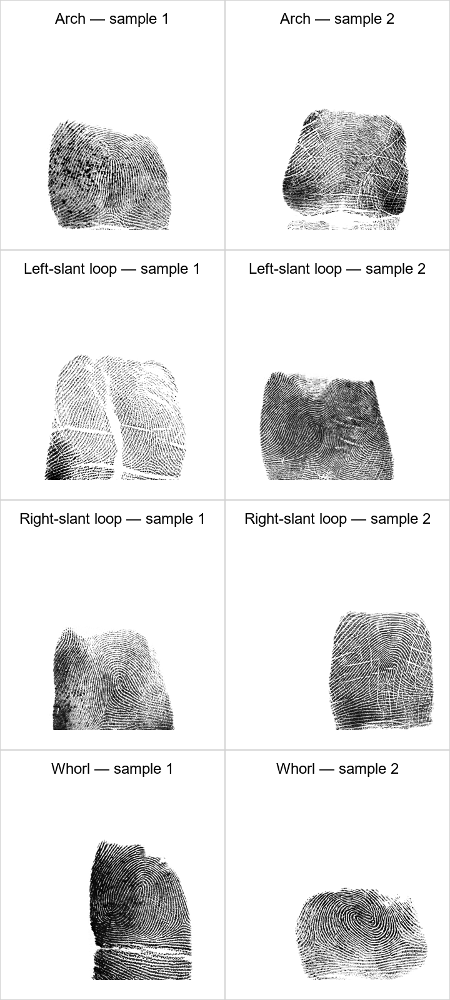
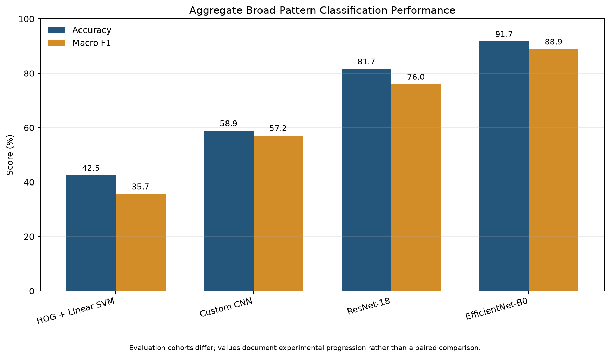
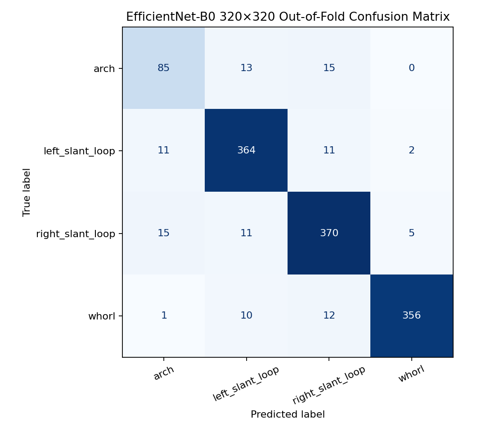
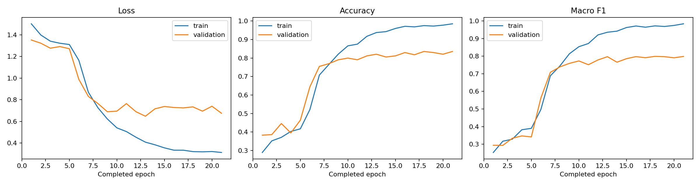

# Automation of Dermatoglyphic Pattern Recognition and Quantification Through Machine Learning

## Abstract

This repository presents a reproducible machine-learning workflow for classifying rolled fingerprint impressions into four broad dermatoglyphic pattern classes: arch, left-slant loop, right-slant loop, and whorl. Pattern annotations are extracted from NIST Special Database 302g Electronic Biometric Transmission Specification (EBTS) Image Request Response records and linked to corresponding fingerprint images from NIST SD 302a and SD 302b. The workflow includes label extraction, visual and statistical quality assessment, subject-disjoint data partitioning, classical machine-learning baselines, convolutional neural networks, transfer learning, and grouped cross-validation.

The strongest completed experiment uses an ImageNet-pretrained EfficientNet-B0 model with 320 × 320 contrast-limited adaptive histogram equalization (CLAHE) inputs. Five-fold grouped cross-validation produced an out-of-fold accuracy of **91.73%** and macro-averaged F1 score of **88.90%** across 1,281 images from 110 subjects. All partitioning is performed at subject level to prevent identity leakage.

## Research Objectives

The study addresses the following objectives:

1. Develop a machine-learning model for classifying rolled fingerprint images into four broad dermatoglyphic patterns: arch, left-slant loop, right-slant loop, and whorl.
2. Compare the performance of classical machine learning, a custom convolutional neural network, and transfer-learning architectures for fingerprint-pattern classification.
3. Evaluate model generalisation using subject-disjoint data partitions that prevent identity leakage.
4. Determine the best-performing approach using accuracy, precision, recall, macro-averaged F1 score, and class-level performance.
5. Investigate the principal classification errors and the influence of class imbalance on minority-pattern recognition.
6. Develop and deploy a web application that enables authorized users to submit a fingerprint image and receive the trained model's broad-pattern prediction with an associated confidence score.
7. Explore whether the available examiner-supplied annotations support preliminary discrimination of selected arch and whorl subtypes.

## Research Questions

The primary research question is:

> To what extent can classical machine-learning and deep-learning approaches accurately classify rolled fingerprint images into broad dermatoglyphic pattern classes under subject-disjoint evaluation?

The supporting research questions are:

1. How does a custom CNN compare with HOG-based machine learning and pretrained transfer-learning models?
2. Which broad fingerprint classes are most difficult to distinguish?
3. How do class imbalance and annotation ambiguity affect classification performance?
4. Do the available confirmed annotations provide sufficient preliminary evidence for distinguishing selected arch and whorl subtypes?

The web application constitutes the practical implementation of the selected model. Its purpose is to demonstrate controlled end-to-end inference rather than provide a forensic identification or autonomous decision-making system.

## Dataset and Annotation Structure

The local workflow processed 2,380 SD 302g IRR records and identified 2,312 rolled fingerprint images suitable for broad-pattern modelling. These images represent 200 subjects. The four broad classes are derived from the ANSI/NIST pattern codes:

| EBTS code | Broad class |
|---|---|
| `AU`, `AU+PA`, `AU+TA` | Arch |
| `LS` | Left-slant loop |
| `RS` | Right-slant loop |
| `WU`, `WU+PW`, `WU+CP`, `WU+DL`, `WU+AW` | Whorl |

Detailed subtypes are retained where present: plain arch, tented arch, plain whorl, central-pocket-loop whorl, double-loop whorl, and accidental whorl. Generic `AU` and `WU` annotations do not specify a subtype. Repeated `9.307` entries represent permissible alternative classifications rather than simple duplicate-label errors; consequently, ambiguous records must not be converted automatically into definitive single-label ground truth.

The complete NIST SD 302 data are not distributed through this repository. The only fingerprint images included are the eight resized, labeled training examples shown below; access to the source dataset remains subject to the terms established by NIST.

### Annotation Preparation

Examiner-supplied pattern annotations were extracted from field `9.307` of the SD 302g EBTS records and linked to corresponding rolled fingerprint impressions. This extraction and linkage procedure constitutes dataset preparation rather than an independent research objective.

### Representative Training Images

The following examples were selected reproducibly from the subject-disjoint training split. Two impressions from different subjects are shown for each broad class. Published filenames and visible labels contain the broad class and sample number only; subject identifiers and source metadata are not included.



The eight [individual labeled PNG files](docs/training_samples/) are generated by [`scripts/generate_training_sample_gallery.py`](scripts/generate_training_sample_gallery.py). They are documentation examples, not a substitute for the complete training dataset.

## Experimental Design and Leakage Control

Data leakage is controlled through the following measures:

- all train, validation, test, and cross-validation partitions are grouped by `subject_id`;
- no subject may occur in more than one partition within an experiment;
- preprocessing statistics and model fitting are restricted to the corresponding training partition;
- the EfficientNet development set excludes 60 subjects used by earlier experiments;
- a further 30-subject, 334-image holdout remains locked and has not been used for model selection;
- subject-level predictions, full-resolution source collections, redistribution-restricted archives, and deploy-time checkpoint payloads are excluded from the current Git tree; the app retrieves the five frozen checkpoints from a commit-pinned source and verifies their SHA-256 hashes, and the only biometric-image exception is the small, resized documentation gallery above.

Subject-disjoint partitioning and locked-holdout construction form part of the experimental methodology used to support credible evaluation; they are not treated as separate research outcomes.

The EfficientNet dataset is partitioned by experiment role:

| Role | Subjects | Images | Purpose |
|---|---:|---:|---|
| Grouped cross-validation | 110 | 1,281 | Model development and out-of-fold estimation |
| Previously evaluated | 60 | 697 | Excluded from later model selection |
| Locked holdout | 30 | 334 | Reserved for final assessment |

## Methods

### HOG and Linear SVM

The classical baseline combines Histogram of Oriented Gradients features with a linear support-vector classifier. This experiment establishes performance attainable from fixed, hand-engineered ridge-orientation descriptors.

### Custom Convolutional Neural Network

A compact CNN is trained on 160 × 160 grayscale images. This experiment evaluates representation learning without pretrained visual features.

### ResNet-18 Transfer Learning

An ImageNet-pretrained ResNet-18 is optimized in two stages: classifier-head training followed by full-network fine-tuning at a reduced learning rate.

### EfficientNet-B0 Grouped Cross-Validation

The final development experiment uses 320 × 320 CLAHE-enhanced images, an ImageNet-pretrained EfficientNet-B0 backbone, class-weighted loss, staged fine-tuning, and five-fold `StratifiedGroupKFold` evaluation. Reported predictions are out-of-fold predictions: each image is evaluated by a model that was not trained on that image or its subject.

## Results

| Experiment | Evaluation protocol | Images evaluated | Accuracy | Macro F1 |
|---|---|---:|---:|---:|
| HOG + Linear SVM | Fixed subject-disjoint test set | 348 | 42.53% | 35.70% |
| Custom CNN | Fixed subject-disjoint test set | 348 | 58.91% | 57.16% |
| ResNet-18 | Subject-disjoint test set | 349 | 81.66% | 76.02% |
| EfficientNet-B0 | Five-fold grouped out-of-fold evaluation | 1,281 | **91.73%** | **88.90%** |

These results show a consistent improvement from fixed descriptors to learned convolutional representations and then to higher-resolution transfer learning. Because the experiments use related but not identical evaluation subsets, the table documents empirical progression rather than a strict paired statistical comparison.



### EfficientNet-B0 Class-Level Performance

| Class | Precision | Recall | F1 score | Support |
|---|---:|---:|---:|---:|
| Arch | 75.89% | 75.22% | 75.56% | 113 |
| Left-slant loop | 91.46% | 93.81% | 92.62% | 388 |
| Right-slant loop | 90.69% | 92.27% | 91.47% | 401 |
| Whorl | 98.07% | 93.93% | 95.96% | 379 |

Arch remains the most difficult and least represented broad class. Whorl classification is strongest, while both loop directions exceed 91% F1.





## Repository Structure

```text
notebooks/
  01_data_prep.ipynb
  02_dataset_review_and_split.ipynb
  03_model_training_baseline.ipynb
  04_cnn_preprocessing_for_colab.ipynb
  04_model_training_cnn.ipynb
  05_cnn_training_colab.ipynb
  06_resnet18_finetuning_colab.ipynb
  07_efficientnet_320_grouped_cv_colab.ipynb
results/
  *.csv
  figures/*.png
docs/
  training_samples/*.png
relabeling/
  CLIENT_RELABELING_INSTRUCTIONS.md
scripts/
  build_client_relabeling_package.py
  build_roll_320_clahe_package.py
  generate_training_sample_gallery.py
```

The [`results`](results/) directory contains aggregate classification reports, fold summaries, training histories, and non-biometric visualizations. The [`notebooks`](notebooks/) directory provides the ordered analytical workflow.

## Subclass Classification

The source annotations provide exact subclasses for only a minority of arch and whorl records. A metadata audit established that 59 of the 827 initially flagged records can be resolved conservatively from direct subtype annotations or consistent same-finger evidence. The remaining generic or alternative classifications require expert visual assessment if definitive single-label subtype ground truth is required.

Subclass modelling is treated as an exploratory secondary analysis rather than a validated system for identifying every arch and whorl subtype. It should initially:

- retain exact original subtype annotations;
- model alternative classifications as multi-label evidence;
- exclude unresolved generic `AU` and `WU` records from definitive subtype supervision;
- use class weighting and grouped validation for rare subclasses;
- employ expert review for a smaller, information-rich subset rather than relabelling all 827 images.

Model-generated pseudo-labels may support review prioritization but must not be represented as examiner-confirmed ground truth.

## Reproducibility

The notebooks are ordered according to the intended execution sequence. Google Colab notebooks mount Drive, extract only the required development artifacts, and verify that locked-holdout files are absent from the runtime. Aggregate experiment outputs are versioned in [`results`](results/); large arrays, full-resolution image collections, archives, subject-level prediction tables, and weights remain outside the current Git tree. For deployment, the app downloads the five frozen broad-classifier checkpoints from an immutable source commit and verifies their sizes and SHA-256 hashes before loading them. The small README gallery can be regenerated locally from the ignored training data with [`scripts/generate_training_sample_gallery.py`](scripts/generate_training_sample_gallery.py).

## Web Application and Deployment

The implemented broad-pattern application provides a controlled Streamlit interface for dermatoglyphic pattern classification. An authorized user uploads one rolled fingerprint image, after which the application applies the same preprocessing used during model development and returns:

- the predicted broad pattern class;
- the model confidence score;
- a clear indication that the result is generated by a research model; and
- a visualization of all four class probabilities;
- agreement across the five grouped-cross-validation checkpoints;
- the margin between the two leading classes; and
- the deterministic 320 × 320 model-input preview.

The application uses a frozen five-checkpoint EfficientNet-B0 ensemble and a fixed inference pipeline. Uploaded biometric images are processed transiently in memory and are not retained by default. The displayed probability is a model score rather than a calibrated guarantee of correctness. The application is a research prototype and must not be represented as a forensic identification system.

The implementation, local instructions, and deployment settings are documented in [`broad_classifier/`](broad_classifier/). The private expert subtype-review application remains separate under [`annotation_app/`](annotation_app/).

## Ethical and Data-Governance Considerations

Fingerprint impressions constitute biometric data. Derived images and subject-linked records must be stored and transmitted only through authorized secure channels. Apart from the eight resized NIST training examples included for transparent class documentation, public repository contents are restricted to source code, notebooks, aggregate numerical results, and visualizations that do not expose subject identifiers. These examples must not be used for forensic identification.

## References

1. Fiumara, G., Schwarz, M., Heising, J., Peterson, J., Flanagan, P., and Marshall, K. (2021). *NIST Special Database 302 Supplemental Release of Latent Annotations*. NIST Technical Note 2190.
2. Fiumara, G. et al. (2019). *NIST Special Database 302: Nail to Nail Fingerprint Challenge*. NIST Technical Note 2007.
3. ANSI/NIST-ITL 1-2011 Update:2015. *Data Format for the Interchange of Fingerprint, Facial and Other Biometric Information*.
